##### 登入

地址:http://localhost:8080/user/login

方式:post

请求参数:

```
{"username":"Childwanwan","password":"123"}
```

示例:

```
var data=JSON.stringify({"username":"Childwanwan","password":"123"});
		$.ajax({
			url: "http://localhost:8080/user/login",
			method: "POST",
			data: data,
        	contentType:"application/json",
			success: res=>{
				console.log(res)
				$("#result").text(res)
			}
		})
```

返回:

```
{
    code:1,		//1成功,-1失败
    message:'',
    date:''		//成功把用户信息返回,前端根据role值确定身份信息，1是项目经理，可以提交故障单及派送，				  //2是技术人员，处理项目经理派送信息的
}
```

示例:


##### 获取分支

地址:http://localhost:8080/branch/test

方式:get

请求参数:无

示例:

```
$.ajax({
			url: "http://localhost:8080/branch/test",
			method: "get",
			success: res=>{
				console.log(res)
				$("#result").text(res)
			}
		})
```

返回：

```
[
{branchName: "上海分支",createTime: {date: 5, day: 2, hours: 11, minutes: 13, month: 2, …}
id: 1}
]
//时间意义不大，前端随意处理
```

示例:

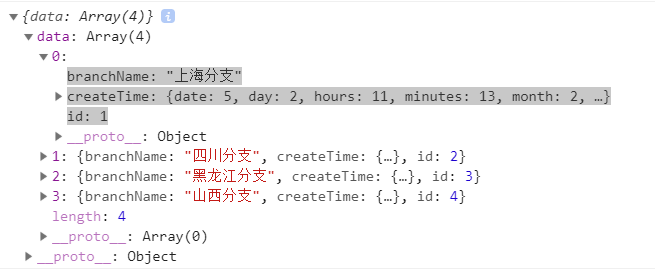

##### 提交故障数据

地址:http://localhost:8080/fault/post_fault

请求方式:post

请求参数:

```
{
"name":"故障单名称",
"createDate":"11111111111",		//时间
"branch":2, 				
"description":"描述信息",
"username":"CHildwanwan",
"url":"www.baidu.com",			//文件上传的url,这个需要和张帅交互
"influenceSystem":["订单中心","账单中心","开通中心"]
}
```

示例：

```
var data=JSON.stringify({"name":"故障单名称","createDate":"11111111111","branch":2, "description":"描述信息","username":"CHildwanwan","url":"www.baidu.com",
			"influenceSystem":["订单中心","账单中心","开通中心"]
	});
		$.ajax({
			url: "http://localhost:8080/fault/post_fault",
			method: "POST",
			data: data, //不能直接写成 {id:"123",code:"tomcat"}
        	contentType:"application/json",
			success: res=>{
				console.log(res)
				$("#result").text(res)
			}
		})
```

返回:

```
code: 1											//1成功，0失败，-1异常
data: "87647b0e45714472947435fcd763295a"		//插入故障单的id
message: "插入数据成功"
```

示例:

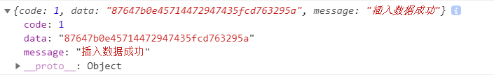

##### 查询所有故障单(不分页)

地址:http://localhost:8080/fault/test

请求方式:get

请求参数:无

请求示例:

```
$.ajax({
			url: "http://localhost:8080/fault/test",
			method: "get",
			success: res=>{
				console.log(res)
				$("#result").text(res)
			}
		})
```

返回：

```
[
{
branch: 1
createDate: {date: 5, day: 2, hours: 0, minutes: 0, month: 2, …}	//时间格式未处理
description: "这是一个测试数据"
id: "1"
influenceSystem: "["订单中心"]"
name: "故障单测试数据"
status: 1					//状态，0已转派，1待转派(新建默认状态)，2成功处理,3技术人员转发给经理
toUsername: "Childwanwan"
url: "www.baidu.com"
username: "childwanwan"
},
{},
{},
{}
]
```

##### 查询所有故障单(分页):

地址:http://localhost:8080/fault/get_fault?currentPage=1

请求方式:get

请求参数:currentPage	，当前页数

请求示例:

```
$.ajax({
			url: "http://localhost:8080/fault/get_fault?currentPage=1",
			method: "get",
			success: res=>{
				console.log(res)
				$("#result").text(res)
			}
		})
```

返回

```
code: 1		//1成功，0失败
count: 4	//所有数据条数
data: [
{branch: 1, createDate: 1551715200000, description: "这是一个测试数据", id: "1", influenceSystem: "["订单中心"]", …},
{},
{},
]
```

##### 故障单模糊查询

地址:http://localhost:8080/fault/get_fault_by_condition

请求方式:post

请求参数:

```
{
"dateBegin":1550774354817,"dateEnd":1551784454817,"name":"故障单","branch":"2"
}			//参数可选
```

示例：

```
var data=JSON.stringify({"dateBegin":1550774354817,"dateEnd":1551784454817,"name":"故障单","branch":"2"});
		$.ajax({
			url: "http://localhost:8080/fault/get_fault_by_condition",
			method: "POST",
			data: data, //不能直接写成 {id:"123",code:"tomcat"}
        	contentType:"application/json",
			success: res=>{
				console.log(res)
				$("#result").text(res)
			}
		})
```

返回：

```
{
code: 1		//0就是没查询到
data:
[
{
branch: 2
createDate: 1551628800000
description: "描述信息"
id: "595ba77ad44143779ee54e39028c0412"
influenceSystem: "["订单中心","账单中心","开通中心"]"
name: "故障单名称"
status: 0
toUsername: "CHildwanwan"
url: "www.baidu.com"
username: "childwanwan"
}
 ]

message: "查询成功"
}
```

返回示例:

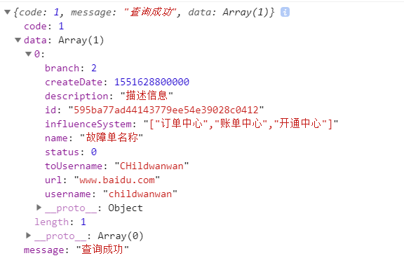

#### 转派(两个请求，一个是获取所以能转派的技术人员,然后再转派给他)

##### 获取技术人员信息：

地址:http://localhost:8080/user/get_user_coding

请求方式:get

请求参数:无

请求示例:

```
$.ajax({
			url: "http://localhost:8080/user/get_user_coding",
			method: "get",
			success: res=>{
				console.log(res)
				$("#result").text(res)
			}
		})
```

返回：

```
code: 1
data: [
 {
 id: "4", 			//技术人员id
 password: "", 		//密码是不可能给你看滴
 role: 2, 			//角色:2代表技术人员,1是项目经理,不应该有项目经理
 username: "qyn"	//技术人员姓名
 }
 ]

message: "获取成功"
```

示例:

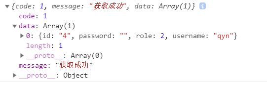

##### 转派信息

地址:http://localhost:8080/fault/transfer_fault_to_coding_man

请求方式:post

请求参数:

```
{
"id":"87647b0e45714472947435fcd763295a",		//需要转派的故障单的id,这个是之前通过故障单查												 //询给的数据,点哪一个就应该绑定那个id
"toUsername":"CHildwanwan"						//需要转派的技术人员的姓名,上一步获取的内容
}
```

请求示例:

```
var data=JSON.stringify({"id":"87647b0e45714472947435fcd763295a","toUsername":"CHildwanwan"});
		$.ajax({
			url: "http://localhost:8080/fault/transfer_fault_to_coding_man",
			method: "POST",
			data: data, //不能直接写成 {id:"123",code:"tomcat"}
        	contentType:"application/json",
			success: res=>{
				console.log(res)
				$("#result").text(res)
			}
		})
```

返回:

```
{
code: 1		//0失败，-1异常
message: "转派成功"
}
```

示例:

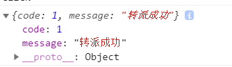

##### 获取项目经理的信息

请求地址：http://localhost:8080/user/get_user_manager

请求方式：get

请求参数：无

请求示例：

```
$.ajax({
			url: "http://localhost:8080/user/get_user_manager",
			method: "get",
			success: res=>{
				console.log(res)
				$("#result").text(res)
			}
		})
```

返回

```
code: 1		//1成功，0失败
data:
[
{
id: "1", 
password: "", 
role: 1, 					//1是项目经理，2是技术人员
username: "Childwanwan"		//名字
}
]
message: "获取数据成功"
```

示例:

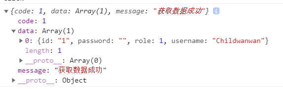

##### 技术人员获取转派的信息

请求地址:http://localhost:8080/deal_fault/test

请求方式:get

请求参数:无

示例:

```
$.ajax({
			url: "http://localhost:8080/deal_fault/test",
			method: "get",
			success: res=>{
				console.log(res)
				$("#result").text(res)
			}
		})
```

返回:

```
code: 1		//1成功，0失败
data: [
{
faultId: "1"		//故障单的id
id: "1"				//转派信息的id
operateTime: "2019-03-05T03:16:02.000+0000"	//时间，格式未处理
status: 1			//状态：0未处理，1是已处理,并派发
toUsername: "qyn"	//转发给谁,在上一个请求中获取
url: "www.github.com"
}
{}
{}
message: "数据查询成功"
```

示例:

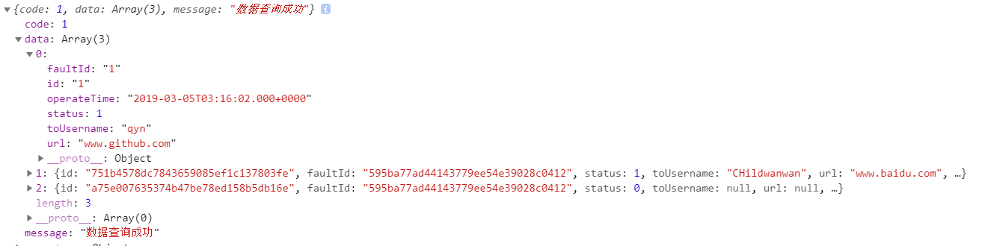

##### 技术人员根据faultId查询故障单信息

请求地址:http://localhost:8080/fault/get_fault_by_faultId?id=595ba77ad44143779ee54e39028c0412

方式:get

参数：id   ?id=1111111111  可以再上面获取

示例：

```
$.ajax({
			url: "http://localhost:8080/fault/get_fault_by_faultId?id=595ba77ad44143779ee54e39028c0412",
			method: "get",
			success: res=>{
				console.log(res)
				$("#result").text(res)
			}
		})
```

返回：

```
{
code: 1			//0失败
data:{
branch: 2		//分支
createDate: {date: 4, day: 1, hours: 0, minutes: 0, month: 2, …}	//时间，格式未处理
description: "描述信息"
id: "595ba77ad44143779ee54e39028c0412"		//id
influenceSystem: "["订单中心","账单中心","开通中心"]"
name: "故障单名称"
status: 0			//状态，0已转派，1待转派，2成功处理,3技术人员再次转发给经理
toUsername: "CHildwanwan"	//转发的技术人员名字
url: "www.baidu.com"		//相关文件地址，需要可以下载，这个功能找张帅
username: "childwanwan"		//创建这个故障单的项目经理的名字
}
message: "获取数据成功"
}
```

示例：

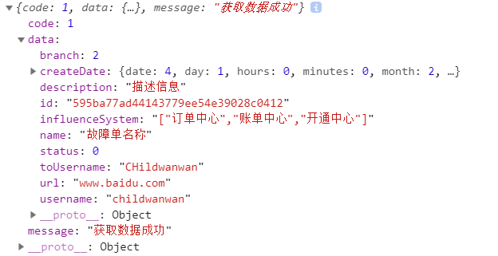

##### 技术人员完成处理后，可以上传相应的文档(张帅)，并转发

##### 转发

地址:http://localhost:8080/deal_fault/transfer

请求方式:post

请求参数:

```
{
"id":"a75e007635374b47be78ed158b5db16e",	//转派信息的id
"faultId":"595ba77ad44143779ee54e39028c0412",	//故障单的id
"toUsername":"CHildwanwan",				//转派给谁
"url":"www.baidu.com"					//技术人员处理的相关文件地址,上传文件后返回的url
}
```

示例:

```
var data=JSON.stringify({"id":"a75e007635374b47be78ed158b5db16e","faultId":"595ba77ad44143779ee54e39028c0412","toUsername":"CHildwanwan","url":"www.baidu.com"});
		$.ajax({
			url: "http://localhost:8080/deal_fault/transfer",
			method: "POST",
			data: data, //不能直接写成 {id:"123",code:"tomcat"}
        	contentType:"application/json",
			success: res=>{
				console.log(res)
				$("#result").text(res)
			}
		})
```

返回：

```
{
code: 1		//-1处理失败
message: "处理成功"
}
```

示例:

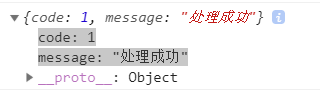

##### 技术人员转发成功后又到了项目经理项目经理应该可以获取该故障下所以得信息

##### 根据故障单id获取所有信息

地址:http://localhost:8080/fault/get_all_data?id=595ba77ad44143779ee54e39028c0412

请求方式:get

请求参数:id

请求示例:

```
$.ajax({
			url: "http://localhost:8080/fault/get_all_data?id=595ba77ad44143779ee54e39028c0412",
			method: "get",
			success: res=>{
				console.log(res)
				$("#result").text(res)
			}
		})
```

返回：

```
dealFault: [
{
    faultId: "595ba77ad44143779ee54e39028c0412"
    id: "751b4578dc7843659085ef1c137803fe"
    operateTime: 1551793974000
    status: 1
    toUsername: "CHildwanwan"
    url: "www.baidu.com"
}
{}
]
fault:{
    branch: 2
    createDate: 1551628800000
    description: "描述信息"
    id: "595ba77ad44143779ee54e39028c0412"
    influenceSystem: "["订单中心","账单中心","开通中心"]"
    name: "故障单名称"
    status: 3
    toUsername: "CHildwanwan"
    url: "www.baidu.com"
    username: "childwanwan"
}
```

示例:

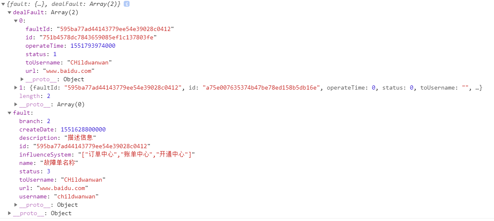

项目经理批准或者不批准

请求地址:http://localhost:8080/fault/agree

请求参数:

```
{
	id:,		//故障单id
    agree："1"，	//不批准，打回重整0
}
```

请求示例

```
var data=JSON.stringify({"id":"595ba77ad44143779ee54e39028c0412","agree":"1"});
		$.ajax({
			url: "http://localhost:8080/fault/agree",
			method: "POST",
			data: data,
        	contentType:"application/json",
			success: res=>{
				console.log(res)
				$("#result").text(res)
			}
		})
```

返回:

```
code: 1					//1是已批准和已驳回重发，0失败
message: "已批准"
```

示例:

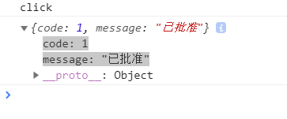